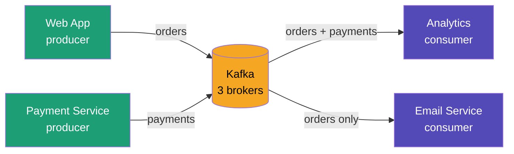

# Lesson 3 — Kafka Multi-Service Demo

Simulating a real-world microservices architecture where multiple services
communicate through Kafka without knowing about each other.

## Architecture



Key idea: **services don't talk to each other directly** — everything goes through Kafka.
If one service goes down, others keep working.

---

## Start cluster

```bash
cd lesson3/scripts
docker-compose -f docker-compose.kraft.yml up -d
```

Wait ~2 min, then open http://localhost:8080

---

## Create topics

```bash
# orders topic — 3 partitions, replicated to all 3 brokers
docker exec -ti kafka1 kafka-topics \
  --create --topic orders \
  --partitions 3 --replication-factor 3 \
  --bootstrap-server kafka1:19092

# payments topic
docker exec -ti kafka1 kafka-topics \
  --create --topic payments \
  --partitions 3 --replication-factor 3 \
  --bootstrap-server kafka1:19092

# verify
docker exec -ti kafka1 kafka-topics \
  --describe --topic orders \
  --bootstrap-server kafka1:19092
```

---

## Run the demo (4 terminals)

**Terminal 1 — Web App (producer → orders)**
```bash
docker exec -ti kafka1 kafka-console-producer \
  --topic orders \
  --bootstrap-server kafka1:19092
```
Type messages like:
```
order-1: laptop purchased by maria
order-2: phone purchased by john
```

**Terminal 2 — Payment Service (producer → payments)**
```bash
docker exec -ti kafka2 kafka-console-producer \
  --topic payments \
  --bootstrap-server kafka2:19093
```
Type messages like:
```
payment-1: 999eur charged for order-1
payment-2: 599eur charged for order-2
```

**Terminal 3 — Analytics (consumer ← orders + payments)**
```bash
# --include accepts a regex pattern for multiple topics
docker exec -ti kafka3 kafka-console-consumer \
  --include 'orders|payments' \
  --from-beginning \
  --bootstrap-server kafka3:19094
```
Receives ALL messages from both topics.

**Terminal 4 — Email Service (consumer ← orders only)**
```bash
docker exec -ti kafka1 kafka-console-consumer \
  --topic orders \
  --from-beginning \
  --bootstrap-server kafka1:19092
```
Receives only orders — triggers emails to customers.

---

## Fault tolerance demo

```bash
# Stop one broker
docker stop kafka3

# Cluster keeps working — describe shows new leaders elected
docker exec -ti kafka1 kafka-topics \
  --describe --topic orders \
  --bootstrap-server kafka1:19092

# Bring it back
docker start kafka3
# kafka3 rejoins ISR automatically
```

---

## Stop cluster

```bash
docker-compose -f docker-compose.kraft.yml down
```

---

## Key config

| Parameter | Value | Why |
|---|---|---|
| `replication-factor 3` | All 3 brokers | Survive 1 broker failure |
| `KAFKA_MIN_INSYNC_REPLICAS` | 2 | Need 2/3 brokers to confirm write |
| `KAFKA_AUTO_CREATE_TOPICS_ENABLE` | false | Explicit topic creation only |
