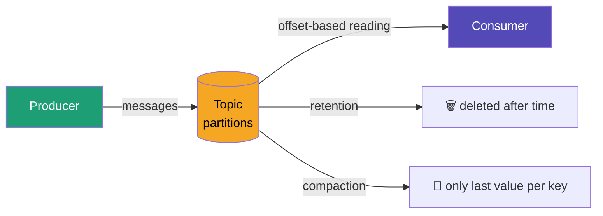

# Lesson 4 — Kafka Topics Practice

Hands-on practice with Kafka topics: partitions, offsets, retention, compaction, tombstones.

## Architecture



## Start

```bash
docker-compose up -d
```

Connect to container:
```bash
docker exec -ti kafka bash
export BS=kafka:9092
```

---

## Practice 1 — list topics

```bash
kafka-topics --bootstrap-server $BS --list
```

---

## Practice 2 — create topic

`--partitions 3` — topic split into 3 independent logs, enables parallel read/write  
`--replication-factor 1` — one copy (single broker setup)

```bash
kafka-topics --bootstrap-server $BS \
  --create --topic kinaction_helloworld \
  --partitions 3 --replication-factor 1
```

---

## Practice 3 — describe topic

Shows partition leaders, replicas, ISR (in-sync replicas):

```bash
kafka-topics --bootstrap-server $BS \
  --describe --topic kinaction_helloworld
```

Expected output:
```
Partition: 0  Leader: 1  Replicas: 1  Isr: 1
Partition: 1  Leader: 1  Replicas: 1  Isr: 1
Partition: 2  Leader: 1  Replicas: 1  Isr: 1
```

---

## Practice 4 — send messages (producer)

```bash
kafka-console-producer --bootstrap-server $BS \
  --topic kinaction_helloworld
```

---

## Practice 5 — read messages (consumer)

`--from-beginning` — read all messages, not just new ones:

```bash
kafka-console-consumer --bootstrap-server $BS \
  --topic kinaction_helloworld \
  --from-beginning
```

---

## Practice 6 — read with partition and offset info

```bash
kafka-console-consumer --bootstrap-server $BS \
  --topic kinaction_helloworld \
  --from-beginning \
  --property print.partition=true \
  --property print.offset=true \
  --property print.key=true
```

**Offset** has two meanings:
- Message offset = position of message in partition (immutable, set by Kafka)
- Consumer committed offset = bookmark of where consumer stopped reading

---

## Practice 7 — send messages with keys

Same key always goes to same partition — guarantees ordering per key:

```bash
kafka-console-producer --bootstrap-server $BS \
  --topic kinaction_helloworld \
  --property "key.separator=:" \
  --property "parse.key=true"
```

```
user-1:maria logged in
user-2:john logged in
user-1:maria clicked button
user-1:maria logged out
```

Distribution formula: `hash(key) % number_of_partitions`

---

## Practice 8 — increase partitions

Partitions can only be **increased**, never decreased.  
Decreasing would break ordering — consumers would lose their committed offsets.

```bash
kafka-topics --bootstrap-server $BS \
  --alter --topic kinaction_helloworld \
  --partitions 5
```

---

## Practice 9 — inspect log files on disk

Kafka stores messages as binary files:

```bash
ls /var/lib/kafka/data/kinaction_helloworld-0/
```

Files:
- `.log` — actual messages (binary)
- `.index` — maps offset → byte position in file
- `.timeindex` — maps timestamp → offset

Human-readable dump:
```bash
kafka-dump-log \
  --files /var/lib/kafka/data/kinaction_helloworld-0/00000000000000000000.log \
  --print-data-log
```

---

## Practice 10 — retention (time-based expiry)

Messages deleted after `retention.ms`. Kafka deletes entire **segments**, not individual messages.  
Segment must be closed first (`segment.ms`), then log cleaner runs every 5 minutes.

```bash
kafka-topics --bootstrap-server $BS \
  --create --topic kinaction_retention \
  --partitions 1 --replication-factor 1 \
  --config retention.ms=10000

# To change config on existing topic use kafka-configs (not kafka-topics --alter):
kafka-configs --bootstrap-server $BS \
  --entity-type topics \
  --entity-name kinaction_retention \
  --alter \
  --add-config retention.ms=10000,segment.ms=10000
```

---

## Practice 11 — compaction

Keeps only the **last value per key**. Like UPDATE in a database.

```
Retention  = DELETE — old messages removed after time
Compaction = UPDATE — only latest value per key kept
```

```bash
kafka-topics --bootstrap-server $BS \
  --create --topic kinaction_compaction \
  --partitions 1 --replication-factor 1 \
  --config cleanup.policy=compact \
  --config min.cleanable.dirty.ratio=0.001 \
  --config segment.ms=10000
```

Use case: user profiles, inventory state, any "current state" data.

---

## Practice 12 — tombstone (delete a key)

Send message with same key but **NULL value** → Kafka deletes that key during compaction:

```bash
kafka-console-producer --bootstrap-server $BS \
  --topic kinaction_compaction \
  --property "key.separator=:" \
  --property "parse.key=true" \
  --property "null.marker=NULL"
```

```
user-1:NULL
```

---

## Practice 13 — delete records up to offset

Used for GDPR compliance — delete specific messages:

```bash
echo '{"partitions":[{"topic":"kinaction_delete","partition":0,"offset":3}],"version":1}' \
  > /tmp/delete.json

kafka-delete-records --bootstrap-server $BS \
  --offset-json-file /tmp/delete.json
```

`low_watermark: 3` — messages at offsets 0,1,2 deleted. Consumers can no longer read them.

---

## Stop

```bash
docker-compose down
```
